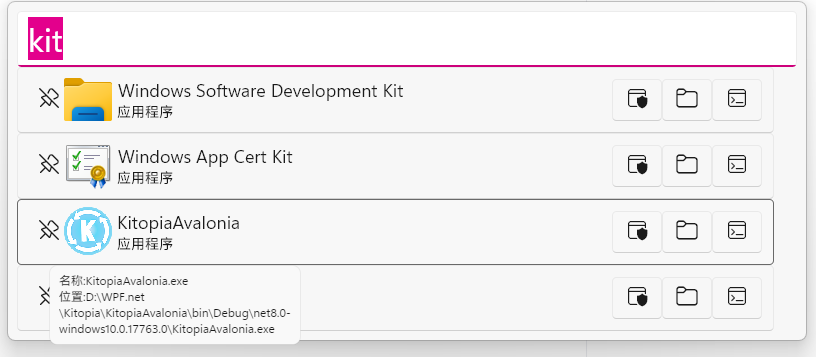
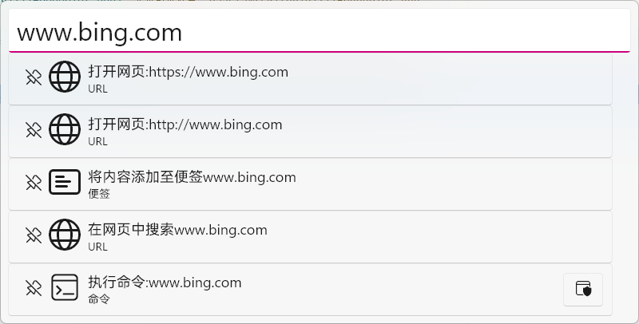

# Kitopia
> [English](/en-us/)
> 
开源 自由 插件化 节点化的工具集合
# 这是什么
这是一个开源的工具集合，用于解决日常操作中大部分问题.  
与其他工具不同的是，这个工具是插件化且节点化的,有什么用?  
其它工具只能用插件来拓展功能,而Kitopia在此基础上引入了节点化编辑(类似Unreal蓝图),这样你可以自由的组合节点来实现你想要的功能,而不是被固定的插件功能所限制.  
调用来自任何插件的任何功能,组合成你想要的功能.
# 特点 
1. 开源
2. 全平台支持(目前优先开发Windows)
3. 插件化
4. 节点化
5. 本地功能免费

# 功能
## 搜索框（默认快捷键 Alt+Space ）
1. 快速打开本地项目(常规软件,UWP软件,桌面文件和文件夹,自定义文件)  
(以管理员身份运行,打开项目所在文件夹,在命令行打开项目所在路径)    
支持与`Everything`集成快速打开本地文档  

2. 快速打开本地路径(剪贴板自动检测/手动输入)  

3. 快速打开网页/在网页中搜索  

4. 快速执行命令  

5. 快速保存剪贴板图像到图像文件  

6. 简单的数学计算  

7. 运行Kitopia情景  

## 截图工具 (默认快捷键`Ctrl`+`Alt`+`Q`)
> 对屏幕内容进行截取  

### 捕获屏幕内容

#### 两种截图模式

* 将剪辑直接复制到剪贴板(默认)
* 截取后进行图像批注/修改

图像批注(需在设置中关闭直接复制到剪贴板)  

* 可用工具 
  * 矩形框 圆形框 箭头 画笔 文字 马赛克
* 可调整颜色 粗细 大小
* 可拖动已有的图形(马赛克除外)
* 可撤销操作  

## 鼠标快捷操作 (默认快捷键`长按鼠标侧键2`)

> 快速打开本地项目  
> 

## 插件化平台

>提供SDK支持插件化开发,拓展软件功能(当然直接PR在主程序也是一种方式) 

提供用户友好的可配置界面  

## 场景（你自己的专属功能）
> 编写自己的情景来调用Kitopia软件自身的功能,以及来自插件的拓展功能  
> 节点可视化编辑,无需编写代码,直接拖拽节点来编写自己的情景

