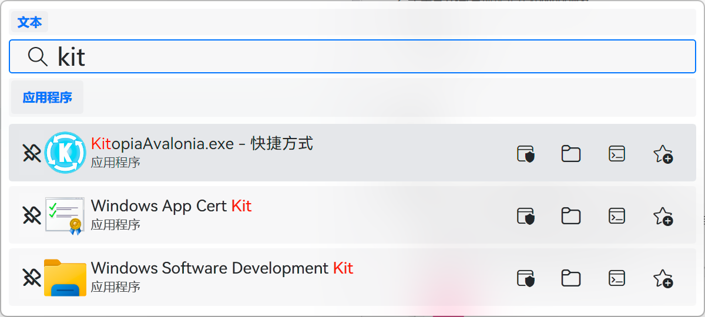
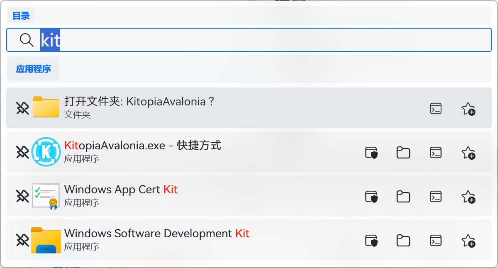
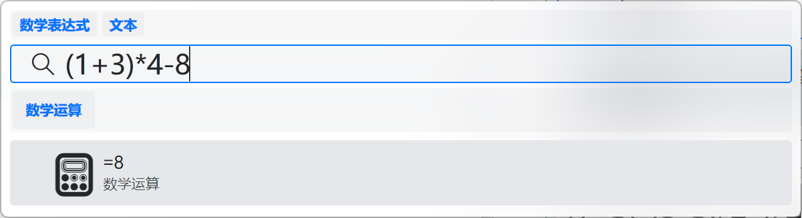
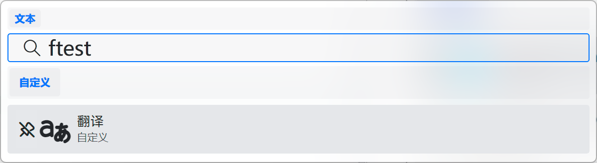
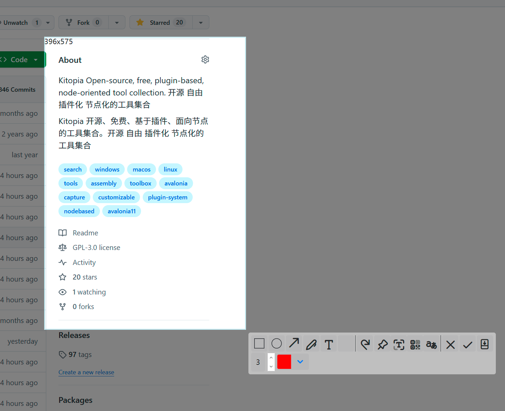
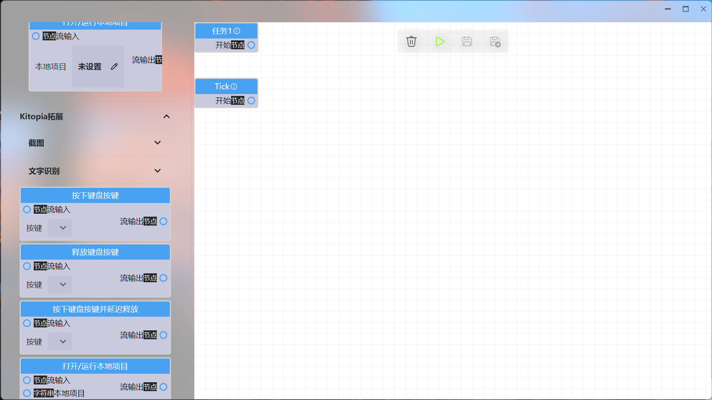
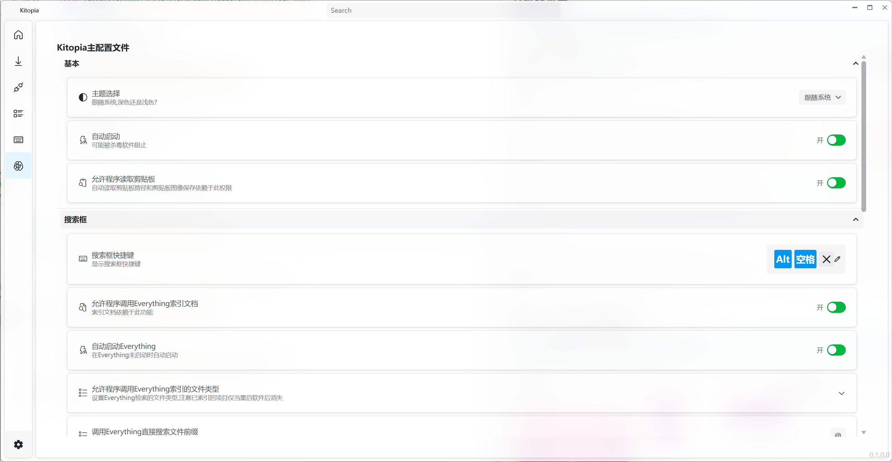

# Kitopia

> [中文](/)

**Open Source · Free · Plugin-based · Node-based** Desktop Utility Collection.

---

## 📖 Introduction

**Kitopia** is more than just a toolbox; it is a **highly customizable productivity platform**.

Unlike other tools, Kitopia introduces **Node-based Visual Scripting** — similar to the Blueprint system in Unreal Engine. This means you are no longer limited to fixed plugin functionalities. Instead, you can combine atomic functions from different plugins like building blocks to create automated workflows that perfectly match your personal needs.

### Core Highlights
- ✨ **Open Source & Free**: Transparent code, local features are completely free.
- 🧩 **Highly Plugin-based**: Modular features, loaded on demand.
- 🔗 **Node-based Programming**: Customize your own features (Scenes) through visual connections.
- 💻 **Cross-platform Architecture**: Built on Avalonia (currently prioritizing Windows support).

---

## 📥 Download & Installation

Please visit the GitHub Releases page to download the latest version:

[👉 Download Kitopia Latest Version](https://github.com/MakesYT/Kitopia/releases)

---

## ⚡ Main Features

### 1. All-in-One Launcher
> Default Shortcut: `Alt` + `Space`

Not just a launcher, but your system console.

- **Quick Start**: Supports standard software, UWP apps, files/folders. Supports running as administrator, opening file locations, etc.
- **Everything Integration**: Millisecond-level search for files across the entire disk.
- **Smart Clipboard Actions**: Automatically recognizes clipboard content (e.g., paths) for one-click opening.
- **Web Search**: Quickly open webpages or search via search engines.
- **Command Execution**: Run Shell commands directly.
- **Utilities**: Math calculation, clipboard image saving, Microsoft translation, etc.

### 2. Ultimate Snipping Tool
> Default Shortcut: `Ctrl` + `Alt` + `Q`

A professional-grade snipping tool supporting **HDR** and **Scrolling Screenshots**.

- **HDR Support**: Perfectly restores high dynamic range visuals without color distortion.
- **Long Screenshot**: Supports scrolling window capture.
- **Rich Annotation Tools**: Rectangles, circles, arrows, brushes, text, mosaic, etc.
- **OCR Text Recognition**: Extract text immediately after capturing.
- **QR Code Recognition**: Automatically recognize QR codes in images.
- **Screenshot Translation**: Translate text directly within the screenshot.
- **Pin**: Pin the screenshot to the screen.

**HDR Effect Comparison:**

**Annotation Mode:**

**Comparison with QQ/WeChat:**

### 3. Mouse Gestures
> Default Shortcut: `Hold Mouse Side Button 2`

Trigger complex operations with simple mouse movements.

### 4. Node-based Scenes
> **The Soul of Kitopia**

Write your own "Scenarios"! Without writing code, drag and connect nodes to call functions from the software itself or plugins.

- **Visual Editing**: Intuitive logic orchestration.
- **Infinite Possibilities**: Combine capabilities of different plugins to build automated tasks.

### 5. Plugin Center

Provides a user-friendly plugin management interface. Developers can use the SDK to develop extended features, and users can install and manage them with one click.

---

## 🛠️ Development & Contribution

PRs and plugin development are welcome!

- [Project Homepage](https://github.com/MakesYT/Kitopia)
- [Submit Issue](https://github.com/MakesYT/Kitopia/issues)
